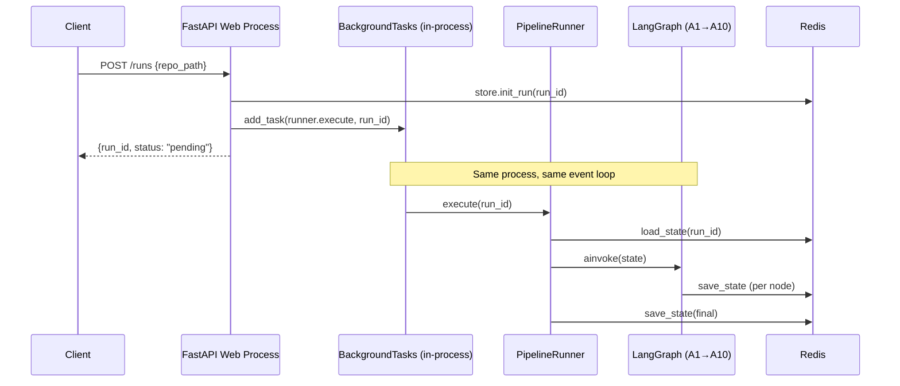
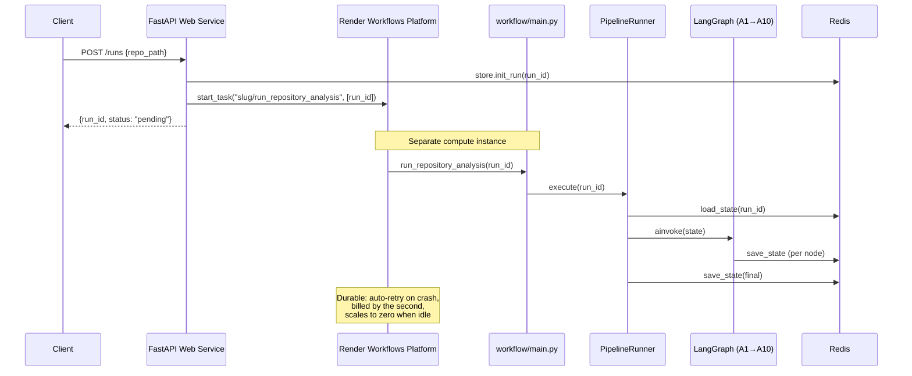
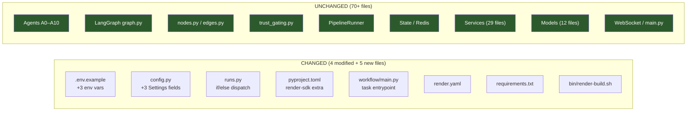
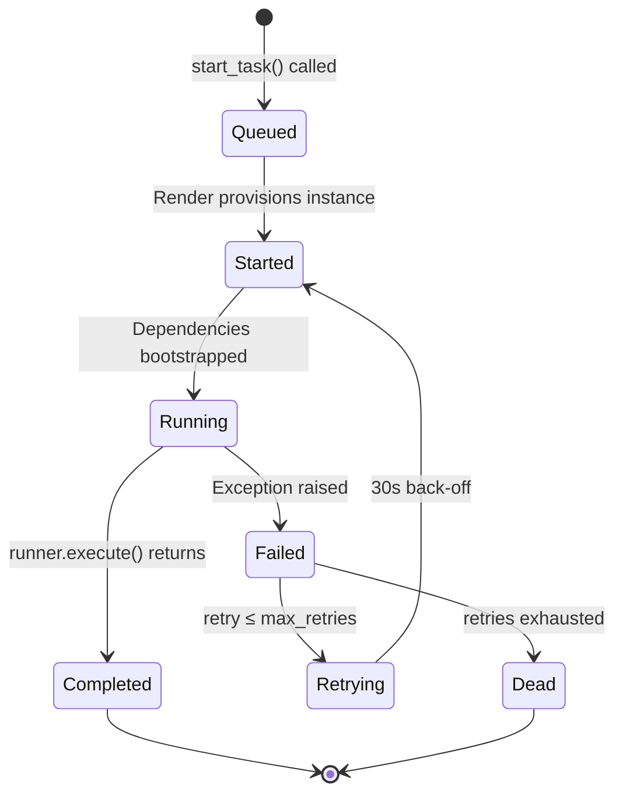
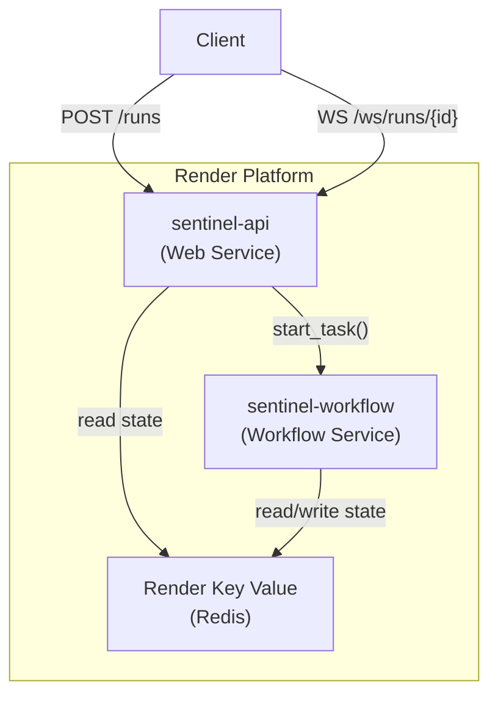

# Render Workflow Integration

> Durable, infrastructure-managed execution of the SENTINEL bug-detection pipeline.

---

## Table of Contents

1. [Architecture Before Render](#1-architecture-before-render)
2. [Architecture After Render](#2-architecture-after-render)
3. [Workflow Lifecycle](#3-workflow-lifecycle)
4. [Deployment Overview](#4-deployment-overview)
5. [Local Development](#5-local-development)
6. [Render Deployment](#6-render-deployment)
7. [Configuration](#7-configuration)
8. [Environment Variables](#8-environment-variables)
9. [Failure Handling](#9-failure-handling)
10. [Retry Strategy](#10-retry-strategy)
11. [Observability](#11-observability)
12. [Future Improvements](#12-future-improvements)

---

## 1. Architecture Before Render

The original architecture runs the entire multi-agent pipeline **in-process**
inside the FastAPI web server via `BackgroundTasks`:



### Limitations

| Problem | Impact |
|---|---|
| **Process-coupled execution** | If the web server restarts, scales, or the dyno cycles, the in-flight pipeline is silently killed mid-execution. |
| **No automatic retry** | A transient failure (OOM, LLM API timeout) permanently loses the run. |
| **Resource contention** | The long-running LangGraph pipeline (10+ agents, LLM calls, subprocess execution) competes for CPU/memory with the HTTP request-serving event loop. |
| **No execution visibility** | No dashboard to monitor task progress, duration, or failure rates outside of Redis events. |

---

## 2. Architecture After Render

The new architecture **decouples** pipeline execution from the web process
by dispatching it as a durable Render Workflow task:



### What Changed vs. What Didn't



> [!IMPORTANT]
> The integration boundary is a **single function call**.  Both paths
> (local and Render) converge on exactly the same line of code:
> `await runner.execute(run_id)`.  Everything downstream is identical.

---

## 3. Workflow Lifecycle

### Task: `run_repository_analysis(run_id: str)`

Defined in [`workflow/main.py`](file:///Users/chelvachezhiyan/Projects/HACKHAZARDS/workflow/main.py).



### Bootstrap Sequence (inside each task execution)

```python
# 1. Load configuration from environment
settings = get_settings()

# 2. Create async Redis connection
redis_client = await create_redis_client(settings)

# 3. Wrap in RedisStore
store = RedisStore(redis_client, settings)

# 4. Build PipelineRunner (constructs LangGraph, MemorySaver)
runner = PipelineRunner(store, settings)

# 5. Execute — the SAME call used by BackgroundTasks
await runner.execute(run_id)

# 6. Close Redis connection (in finally block)
await redis_client.aclose()
```

Each task invocation is **fully self-contained** — it creates and tears down
its own Redis connection.  No shared state between task runs.

---

## 4. Deployment Overview

The system deploys as **two Render services** sharing the same codebase:

| Service | Type | Purpose | Start Command |
|---|---|---|---|
| `sentinel-api` | Web Service | FastAPI HTTP/WS API | `uvicorn backend.main:app --host 0.0.0.0 --port $PORT` |
| `sentinel-workflow` | Workflow | Pipeline execution | `python workflow/main.py` |

Both services:
- Use the same repository
- Share the same build command: `chmod +x bin/render-build.sh && bin/render-build.sh`
- Connect to the same Redis instance
- Read the same environment variables



---

## 5. Local Development

For local development, the Render Workflow is **completely bypassed**.

### Setup

```bash
# 1. Install without render-sdk (standard install)
pip install -e ".[dev]"
python -m spacy download en_core_web_sm

# 2. Start Redis
brew services start redis
# or: docker compose up -d

# 3. Configure
cp .env.example .env
# Edit .env — ensure USE_RENDER_WORKFLOWS=false (the default)

# 4. Start the API
uvicorn backend.main:app --reload --host 127.0.0.1 --port 8000
```

### How It Works Locally

With `USE_RENDER_WORKFLOWS=false` (the default):

1. `render_sdk` is **never imported** — you don't need to install it
2. `POST /runs` uses `BackgroundTasks.add_task(runner.execute, run_id)` — the original behavior
3. The pipeline runs in-process on the same event loop
4. All WebSocket and Redis events work identically

```bash
# Test it
curl -X POST http://127.0.0.1:8000/runs \
  -H "Content-Type: application/json" \
  -d '{"repo_path": "vulnapi"}'
```

### Local Workflow Testing (optional)

If you want to test the workflow entrypoint locally:

```bash
# Install with render extra
pip install -e ".[render]"

# Run the Render CLI local dev server
render workflows dev -- python workflow/main.py
```

---

## 6. Render Deployment

### Step 1 — Create the Web Service (via Blueprint)

1. Push your repository to GitHub / GitLab
2. In the Render Dashboard: **New +** → **Blueprint**
3. Select your repository — Render auto-detects [`render.yaml`](file:///Users/chelvachezhiyan/Projects/HACKHAZARDS/render.yaml)
4. The `sentinel-api` web service is created automatically
5. Set secret environment variables in the Dashboard (see [§8](#8-environment-variables))
6. Deploy

### Step 2 — Create the Workflow Service (manual)

> [!IMPORTANT]
> Render Workflows are **not yet supported** in `render.yaml` Blueprints.
> You must create the Workflow service manually.

1. Dashboard → **New +** → **Workflow**
2. Connect the **same** repository
3. Configure:

| Setting | Value |
|---|---|
| **Build Command** | `chmod +x bin/render-build.sh && bin/render-build.sh` |
| **Start Command** | `python workflow/main.py` |
| **Python Version** | `3.11` |

4. Set the **same** environment variables as the web service
5. Deploy

The `@app.task` decorator on `run_repository_analysis` **automatically registers**
the task with Render when the service starts.  No manual task registration is needed.

### Step 3 — Verify

```bash
# Health check
curl https://sentinel-api.onrender.com/health

# Create a run
curl -X POST https://sentinel-api.onrender.com/runs \
  -H "Content-Type: application/json" \
  -d '{"repo_path": "vulnapi"}'

# Check the Render Dashboard → Workflow service
# You should see a task execution appear
```

### Rollback to Local Mode

To instantly revert to in-process execution without redeploying:

```
# Render Dashboard → sentinel-api → Environment
USE_RENDER_WORKFLOWS=false
```

The web service restarts and all new runs use `BackgroundTasks`.
No code change required.

---

## 7. Configuration

All Render Workflow configuration lives in [`backend/config.py`](file:///Users/chelvachezhiyan/Projects/HACKHAZARDS/backend/config.py#L35-L38)
as part of the existing `Settings` class:

```python
class Settings(BaseSettings):
    # ... existing fields ...

    # ── Render Workflow integration ──────────────────────────────────
    use_render_workflows: bool = False
    render_api_key: str = ""
    render_workflow_slug: str = "sentinel-workflow/run_pipeline"
```

### How the Slug Flows

```
.env / Render Dashboard
    ↓
RENDER_WORKFLOW_SLUG="sentinel-workflow/run_repository_analysis"
    ↓
Settings.render_workflow_slug  (config.py, loaded by pydantic-settings)
    ↓
settings.render_workflow_slug  (injected into runs.py via Depends)
    ↓
render_client.workflows.start_task(settings.render_workflow_slug, [run_id])
```

The workflow slug is **never hardcoded** in any source file.  It is always
read from configuration at runtime.

### Feature Flag Behavior

| `USE_RENDER_WORKFLOWS` | Dispatch method | `render_sdk` imported? | Notes |
|---|---|---|---|
| `false` (default) | `BackgroundTasks` | No | Original behavior, zero dependencies added |
| `true` | `RenderAsync.workflows.start_task()` | Yes (lazy) | Requires `render-sdk` installed and `RENDER_API_KEY` set |

---

## 8. Environment Variables

### Render Workflow Variables

| Variable | Required | Default | Description |
|---|---|---|---|
| `USE_RENDER_WORKFLOWS` | No | `false` | Feature flag to enable Render Workflow dispatch |
| `RENDER_API_KEY` | When `true` | `""` | Render API key for SDK authentication |
| `RENDER_WORKFLOW_SLUG` | No | `sentinel-workflow/run_pipeline` | Task identifier: `service-slug/task-name` |

### Existing Variables (unchanged)

| Variable | Description |
|---|---|
| `LLM_PROVIDER` | `anthropic` or `mistral` |
| `MISTRAL_API_KEY` | Mistral API key |
| `ANTHROPIC_API_KEY` | Anthropic API key |
| `GITHUB_TOKEN` | GitHub PAT for PR creation |
| `REDIS_URL` | Redis connection URL |
| `STUB_MODE` | Use stub agents (no API keys needed) |
| `GITHUB_DRY_RUN` | Skip actual GitHub PR creation |

> [!TIP]
> Both the Web Service and Workflow Service must have access to the **same**
> `REDIS_URL`.  If using Render Key Value, both services must be in the
> same Render environment so they can use the internal connection URL.

### Template

See [`.env.example`](file:///Users/chelvachezhiyan/Projects/HACKHAZARDS/.env.example)
for a complete template with all variables.

---

## 9. Failure Handling

Failures are handled at **two independent layers**.  They do not overlap.

### Layer 1 — Graph-Internal Failures (unchanged)

These are **logical** failures within a successful task execution.
The LangGraph graph handles them via conditional edges:

| Failure Type | Handler | Action |
|---|---|---|
| Insufficient evidence | [`should_reinvestigate()`](file:///Users/chelvachezhiyan/Projects/HACKHAZARDS/backend/orchestrator/edges.py#L11-L20) | Loop A4 (max 2 reinvestigations) |
| Mutation test failure | [`after_mutation()`](file:///Users/chelvachezhiyan/Projects/HACKHAZARDS/backend/orchestrator/edges.py#L23-L34) | Retry A7→A8 (up to `Settings.max_retries`) |
| Security rescan failure | [`after_security()`](file:///Users/chelvachezhiyan/Projects/HACKHAZARDS/backend/orchestrator/edges.py#L37-L45) | Retry A7→A9 (up to `Settings.max_retries`) |
| Validation exhausted | [`apply_trust_gates_before_pr()`](file:///Users/chelvachezhiyan/Projects/HACKHAZARDS/backend/orchestrator/trust_gating.py#L35-L59) | Force draft PR |

These are **completely untouched** by the Render integration.

### Layer 2 — Infrastructure Failures (new)

These are **process-level crashes** that kill the entire task:

| Failure Type | Example | Recovery |
|---|---|---|
| Out of memory | Large repo causes OOM kill | Render auto-restarts task |
| Container eviction | Render infra maintenance | Render auto-restarts task |
| Network partition | Redis/LLM API unreachable | Render auto-restarts after 30s back-off |
| Unhandled exception | Bug in bootstrap code | Render auto-restarts task |

Recovery is governed by the Render SDK retry policy (see [§10](#10-retry-strategy)).

### PipelineRunner Error Handling (unchanged)

The existing error handling in [`runner.py`](file:///Users/chelvachezhiyan/Projects/HACKHAZARDS/backend/orchestrator/runner.py#L36-L40)
captures exceptions, persists them to Redis, and sets `status = "failed"`:

```python
except Exception as e:
    state.status = "failed"
    state.errors.append({"error": str(e), "trace": traceback.format_exc()})
    await self.store.save_state(state)
    raise  # ← re-raised to trigger Render's retry
```

The `raise` at the end is critical — it propagates the exception to
Render, which then decides whether to retry based on the retry policy.

---

## 10. Retry Strategy

### Render Workflow Retry (infrastructure level)

Configured in [`workflow/main.py`](file:///Users/chelvachezhiyan/Projects/HACKHAZARDS/workflow/main.py#L32):

```python
WORKFLOW_RETRY = Retry(max_retries=2, wait_duration_ms=30_000)
```

| Parameter | Value | Rationale |
|---|---|---|
| `max_retries` | 2 | Enough for transient infra issues; avoids runaway LLM cost if the bug is permanent |
| `wait_duration_ms` | 30,000 (30s) | Allows Redis reconnection, LLM rate limits to clear, container to stabilize |

### Retry Timeline Example

```
Attempt 1:  t=0s     → Task starts → crashes at t=45s
                      ⏳ 30s back-off
Attempt 2:  t=75s    → Task restarts → crashes at t=120s
                      ⏳ 30s back-off
Attempt 3:  t=150s   → Task restarts → completes at t=280s ✅
```

If all 3 attempts fail (1 original + 2 retries), the task is marked **dead**
and the run remains in `status: "failed"` in Redis.

### What Is NOT Retried by Render

| Internal retry | Governed by | Render involvement |
|---|---|---|
| A4 reinvestigation | `edges.should_reinvestigate` | None |
| A7/A8 validation loop | `edges.after_mutation` + `Settings.max_retries` | None |
| A8/A9 security loop | `edges.after_security` + `Settings.max_retries` | None |
| Trust gate → draft PR | `trust_gating.py` | None |

These internal retries happen **within** a single successful task execution.
Render never sees them.

---

## 11. Observability

### Workflow Logging

[`workflow/main.py`](file:///Users/chelvachezhiyan/Projects/HACKHAZARDS/workflow/main.py)
emits structured logs via Python's `logging` module:

| Event | Level | Fields | When |
|---|---|---|---|
| `Workflow started` | `INFO` | `run_id` | Task entry |
| `Workflow completed` | `INFO` | `run_id`, `elapsed` | Successful completion |
| `Workflow failed` | `ERROR` + traceback | `run_id`, `elapsed` | Exception (before re-raise) |

#### Example Log Output

```
2026-07-10 12:00:00 INFO workflow.main | Workflow started | run_id=abc-123-def
2026-07-10 12:02:15 INFO workflow.main | Workflow completed | run_id=abc-123-def | elapsed=134.82s
```

```
2026-07-10 12:00:00 INFO workflow.main | Workflow started | run_id=abc-123-def
2026-07-10 12:00:12 ERROR workflow.main | Workflow failed | run_id=abc-123-def | elapsed=12.07s
Traceback (most recent call last):
  File "/app/workflow/main.py", line 60, in run_repository_analysis
    await runner.execute(run_id)
  ...
ConnectionError: Redis connection refused
```

### Render Dashboard

The Render Dashboard provides built-in visibility for Workflow tasks:

- **Task runs list** — see all executions with status, duration, retry count
- **Live logs** — stream stdout/stderr from the running task
- **Metrics** — CPU, memory, execution time per task

### Redis Events (unchanged)

The existing agent event system is **completely unaffected**:

- Each agent emits `AgentStatusEvent` to Redis Streams via `store.append_event()`
- Events are published to `bugfix:{run_id}:live` via Redis Pub/Sub
- WebSocket clients receive them in real-time via [`ws.py`](file:///Users/chelvachezhiyan/Projects/HACKHAZARDS/backend/api/routes/ws.py)

This works identically regardless of whether the pipeline runs via
`BackgroundTasks` or Render Workflows, because both paths use the
same Redis instance and the same `PipelineRunner.execute()` code.

### Monitoring Checklist

| Signal | Source | Local Mode | Render Mode |
|---|---|---|---|
| Agent timeline | Redis events + WebSocket | ✅ | ✅ |
| Run status | `GET /runs/{id}` | ✅ | ✅ |
| Task lifecycle | Workflow logs | N/A | ✅ |
| Execution time | Workflow logs (`elapsed`) | N/A | ✅ |
| Retry attempts | Render Dashboard | N/A | ✅ |
| Infrastructure metrics | Render Dashboard | N/A | ✅ |

---

## 12. Future Improvements

### Near-term

| Improvement | Description |
|---|---|
| **Configurable retry** | Move `max_retries` and `wait_duration_ms` to `Settings` so they can be tuned via env vars without code changes |
| **Task timeout** | Add a `default_timeout` to `Workflows()` to cap maximum execution time (currently unlimited) |
| **Health probe** | Add a `/health` check for Workflow→Redis connectivity, run on task startup before beginning the pipeline |

### Medium-term

| Improvement | Description |
|---|---|
| **Webhook on completion** | Use Render's webhook support to notify an external system (Slack, PagerDuty) when a task completes or exhausts retries |
| **Parallel task fan-out** | Split the parallel intel phase (A1+A2+A3) into separate Render tasks for true process-level isolation |
| **Dead letter queue** | Route permanently failed runs to a DLQ for manual inspection instead of leaving them as `status: "failed"` in Redis |

### Long-term

| Improvement | Description |
|---|---|
| **Multi-repo batch** | Accept a list of repositories in a single API call and dispatch one Render task per repo with managed concurrency |
| **Checkpoint resume** | Leverage LangGraph's `MemorySaver` checkpointing to resume a failed run from the last successful node instead of restarting from scratch |
| **Cost attribution** | Tag Render task runs with `run_id` metadata for per-run cost tracking in the Render billing dashboard |
